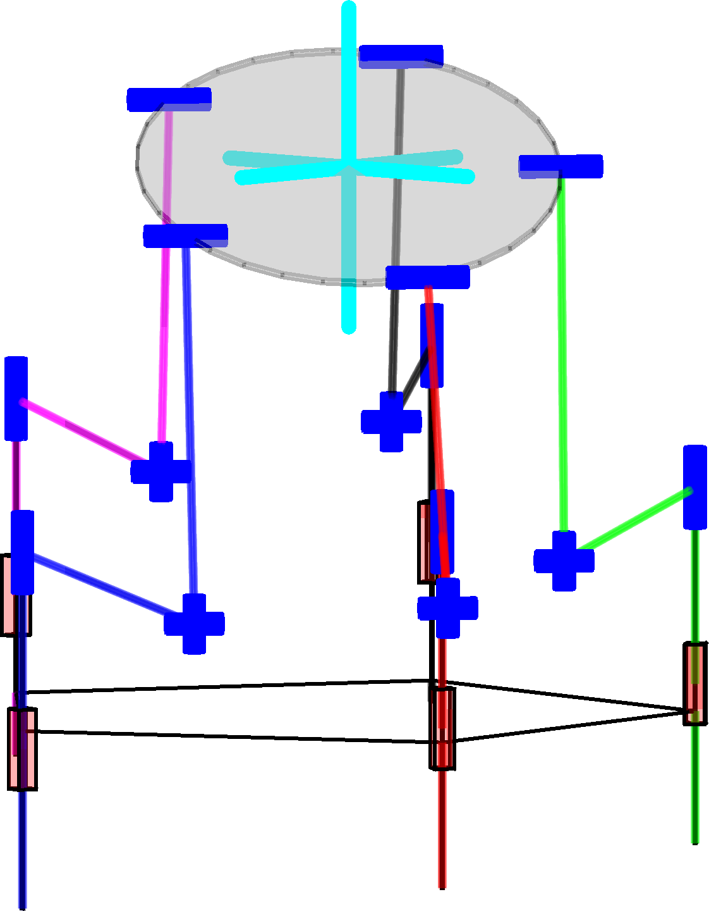
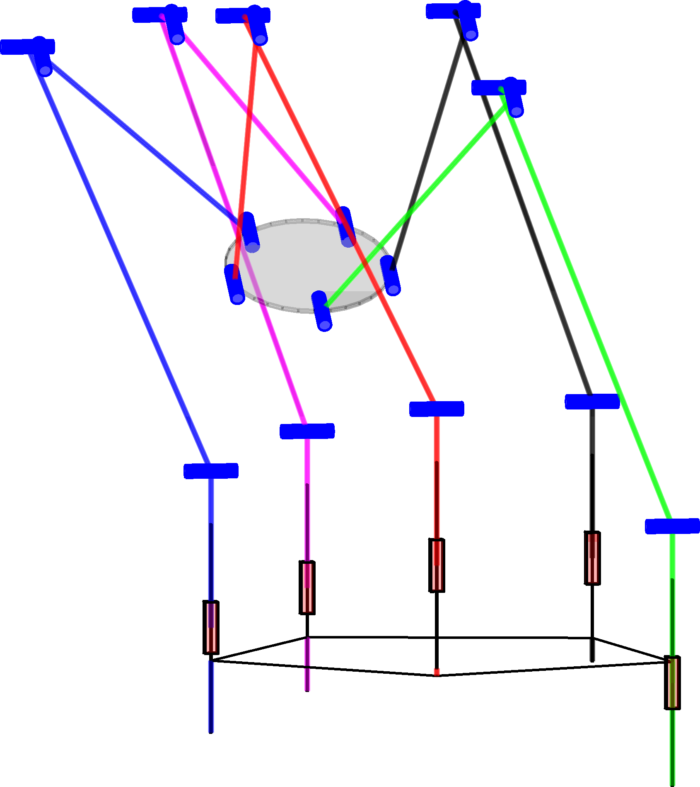
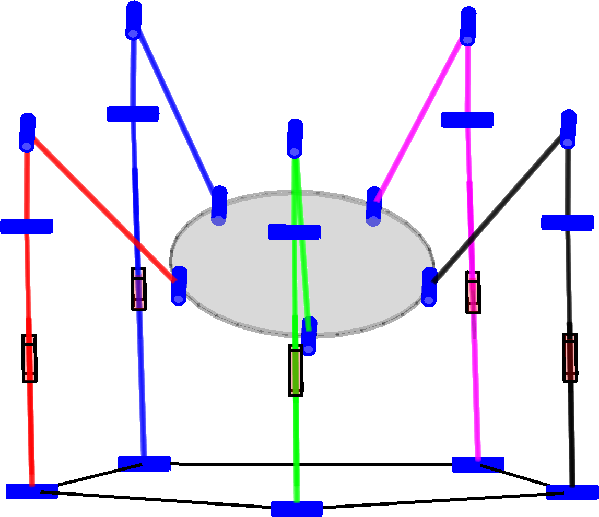
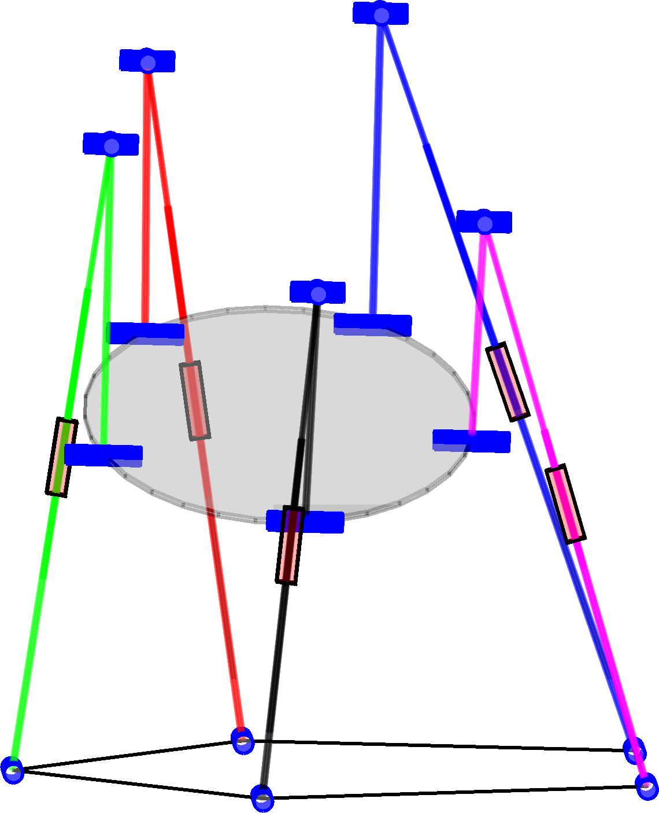

# Structural and Dimensional Synthesis of Overconstraint Symmetric 3T2R Parallel Robots using Tait-Bryan-Angle Kinematic Constraints

Author: Moritz Schappler

This code is supplemental material to the following publication at the [ARK Conference 2022](https://ark2022.com/):

```bib
@InProceedings{Schappler2022,
  author       = {Schappler, Moritz},
  booktitle    = {International Symposium on Advances in Robot Kinematics},
  title        = {Structural and Dimensional Synthesis of Overconstraint Symmetric 3T2R Parallel Robots using Tait-Bryan-Angle Kinematic Constraints},
  organization = {Springer},
  year         = {2022},
  doi          = {10.1007/978-3-031-08140-8_21},
}
```
<p align="middle">


  
  
   
  
</p>
Fig. 3 of the paper: example for 3T2R parallel robots that were synthesized with the proposed toolbox

## Contents and Useage

This repository contains Matlab scripts and Latex code to reproduce results and statements of the paper. Beforehand, the steps from the [prerequesites section](#prerequisites) have to be performed.

### Reproduce Results

Each section of the paper can be reproduced by a Matlab script.

* Sec. 2 (parallel robot model with and without overconstraint)
  * `proof/ParRob_3T2R_mdl_proof.m`
* Sec. 3 (structural synthesis of 3T2R parallel robots)
  * Statement regarding the number of 3T2R parallel robots in the database: See `number_of_robots_in_database.m` in the repository of the parallel robot database (link see below), directory: `examples_tests`
* Sec. 4 (exemplary dimensional synthesis)
  * See next section of this document
* The figures are created using InkScape with Latex export option

## Dimensional Synthesis
  
1. To reproduce the results, first the dimensional synthesis has to be performed by running the Matlab script `dimsynth/dimsynth_3T2R_example.m`.
    * If existing results shall be evaluated, their location has to be set with `ark3T2R_dimsynth_data_dir.m`. Then this step can be omitted
    * The results that were used in the paper are stored in `data/synthesis` and are used by default
2. The results have to be post-processed by the scripts from `dimsynth`:
    * `eval_figures_pareto.m`: Assemble all Pareto fronts for the individual robots
    * `robot_names.m`: The names of the robots have to be generated (e.g. for the legend); only once.
    * `eval_figures_pareto_groups.m`: Group the robots to a smaller set (by combining their base coupling alignments; as done in the paper). This also creates **Fig. 3,a of the paper**.
    * `select_eval_robot_examples.m`: Select the specific robot structures from the Pareto front for the detailed view in Fig. 3.
3. The robot figures and detail information is reproduced with the Matlab scripts from `dimsynth`:
    * `robot_images.m`: Creates one image file for each robot. These are taken in `paper/figures/robots.svg` to create **Fig. 3,b of the paper**.
    * `task_description.m` assembles information that is used within the **text of Sect. 4**.

The steps 2 to 3 can be performed after each iteration of the dimensional synthesis by using `run_evaluation_ark3T2R.m` in the paper repo's root directory.

## Prerequisites <a name="prerequisites">

For the Matlab scripts to work, the following steps have to be performed:

1. Install Matlab (tested with R2021a)
2. Set up the Matlab mex compiler, if not already done
3. Set up the path to the results for this paper by copying `ark3T2R_dimsynth_data_dir.m.template` without the template suffix to the same location and by changing the content of the file to point to the stored results of the synthesis.
4. Download Matlab dependencies:
    * [Toolbox for geometry functions](https://github.com/SchapplM/robotics-dep-geometry) (tested with rev. c4af53d; 2021-10-26)
    * [Toolbox for trajectory functions](https://github.com/SchapplM/robotics-dep-traj) (tested with rev. b13e68d; 2021-08-16)
    * [Collection of external dependencies](https://github.com/SchapplM/robotics-dep-ext) (tested with rev. 14712ae; 2021-12-06)
    * [Toolbox for various Matlab functions](https://github.com/SchapplM/matlab_toolbox) (tested with rev. da5759e; 2022-01-04)
    * [Robotics toolbox](https://github.com/SchapplM/robotics-toolbox) (tested with rev. 430fce8;2022-01-09)
    * [Serial robot model database](https://github.com/SchapplM/robsynth-serroblib) (tested with rev. 0402a5157; 2021-12-07)
    * [Parallel robot model database](https://github.com/SchapplM/robsynth-parroblib) (tested with rev. 654ed5d; 2022-01-09)
    * [Toolbox for symbolic robot model generation](https://github.com/SchapplM/robsynth-modelgen) (tested with rev. 008671b; 2021-12-12)
    * [Toolbox for transferring jobs to a computing cluster](https://github.com/SchapplM/matlab_pbs_transfer) (tested with rev. a5fcd69; 2021-12-08)
    * [Dimensional synthesis toolbox](https://github.com/SchapplM/robsynth-structdimsynth) (tested with rev. a5f0d2d; 2022-01-14)
    * Update the repositories to the given versions. You should first try the more recent version before downgrading to the given versions. It should still work.
    * Short command to download all repositories (run in Git Bash in Windows or in Linux terminal):
      ```Bash
      git clone git@github.com:SchapplM/robotics-dep-geometry.git
      git clone git@github.com:SchapplM/robotics-dep-traj.git
      git clone git@github.com:SchapplM/robotics-dep-ext.git
      git clone git@github.com:SchapplM/matlab_toolbox.git
      git clone git@github.com:SchapplM/robotics-toolbox.git
      git clone git@github.com:SchapplM/robsynth-serroblib.git
      git clone git@github.com:SchapplM/robsynth-parroblib.git
      git clone git@github.com:SchapplM/robsynth-modelgen.git
      git clone git@github.com:SchapplM/matlab_pbs_transfer.git
      git clone git@github.com:SchapplM/robsynth-structdimsynth.git
      ```
5. Set up the toolboxes by modifying the following files according to the instructions in the respective README files
    * robsynth-serroblib/maplerepo_path.m.template (has to link to robsynth-modelgen)
    * robsynth-structdimsynth/computingcluster_repo_path.m.template (has to link to matlab_pbs_transfer)
6. Run the path initialization scripts (`..._path_init.m`) of all downloaded software repos in Matlab. Put the run commands in the startup.m file of Matlab if used frequently.

